<!-- Terminal-style Animated GitHub Profile -->

<!-- Typing welcome -->

 

<!-- Contribution Heatmap -->
<picture>
  <source media="(prefers-color-scheme: dark)" srcset="contrib-heatmap-dark.svg">
  <source media="(prefers-color-scheme: light)" srcset="contrib-heatmap-light.svg">
  
</picture>

 

<!-- ASCII Portrait + Info Card -->
<table><tr>
<td width="45%" align="center">
<picture>
  <source media="(prefers-color-scheme: dark)" srcset="pranjal-ascii-dark.svg">
  <source media="(prefers-color-scheme: light)" srcset="pranjal-ascii-light.svg">
  
</picture>
</td>
<td width="55%" align="center">
<picture>
  <source media="(prefers-color-scheme: dark)" srcset="info-card-dark.svg">
  <source media="(prefers-color-scheme: light)" srcset="info-card-light.svg">
  
</picture>
</td>
</tr></table>

 

<!-- Streak Stats -->

 

  

<!-- Contribution Snake -->
<picture>
  <source media="(prefers-color-scheme: dark)" srcset="https://raw.githubusercontent.com/Pranjal240/Pranjal240/output/github-snake-dark.svg" />
  <source media="(prefers-color-scheme: light)" srcset="https://raw.githubusercontent.com/Pranjal240/Pranjal240/output/github-snake.svg" />
  
</picture>

 

<!-- Social Badges -->

&nbsp;&nbsp;

&nbsp;&nbsp;

